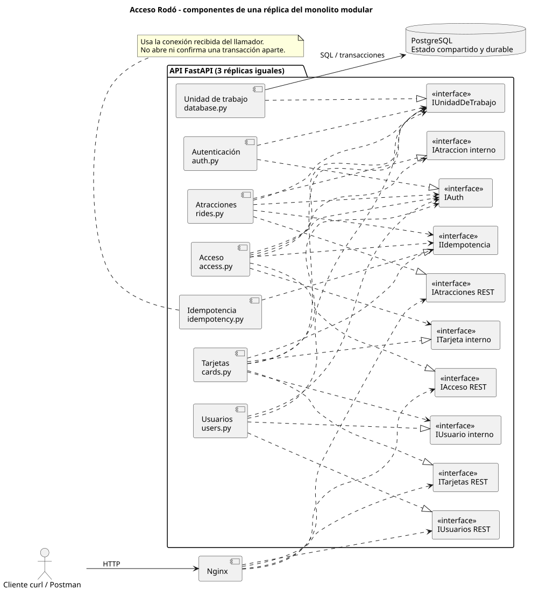

# Trabajo final de unidad 3 — Acceso Rodó

**Grupo 7 — Thomas Cooper, Emanuel Fraga y Bruno Villero**

Análisis y Diseño de Aplicaciones II — Universidad Católica del Uruguay

## 1. Contexto y alcance

La TFU 1 definió Acceso Rodó como un sistema de tarjetas prepagas para venta y control de acceso a juegos del Parque Rodó. La TFU 2 implementó una API genérica con replicación, reintentos, autenticación y validación de entradas. Esta entrega combina el dominio de la primera con la infraestructura de la segunda.

El alcance seleccionado es registrar usuarios, crear/recargar tarjetas, consultar saldo e historial, administrar atracciones, validar accesos y finalizar rondas. Al ingresar se comprueba que usuario y tarjeta estén activos, que la atracción esté operativa y tenga capacidad, y que exista saldo suficiente. Se cobra, registra el movimiento y aumenta la ocupación.

Se excluyen lectores físicos, pagos reales, aplicación web, promociones, operación offline, monitoreo global del parque y despliegue blue-green. No afirmamos satisfacer todos los ASR de TFU 1: seleccionamos un recorrido suficiente para demostrar los conceptos exigidos por TFU 3.

## 2. Partición e identificación de componentes

La partición de primer nivel es **por dominio**. Partimos de las historias de usuario y agrupamos responsabilidades con reglas y datos propios:

1. Comprar/recargar y consultar saldo/historial identifica **Tarjetas**.
2. Registrar visitantes y verificar identidad identifica **Usuarios**.
3. Configurar precio, estado, aforo y finalizar rondas identifica **Atracciones**.
4. Decidir un ingreso combinando saldo y disponibilidad identifica **Acceso**, coordinador del caso de uso.
5. Autenticación, idempotencia y unidad de trabajo son componentes técnicos transversales que soportan esa partición.

Preferimos esta partición a una primera división exclusiva en controladores, servicios y repositorios porque hace explícitas las responsabilidades del negocio y las colaboraciones necesarias. En esta implementación pequeña cada módulo agrupa sus rutas y operaciones de dominio; una evolución podría separar internamente transporte y persistencia. No se introdujo esa separación adicional solo para aumentar archivos.

La arquitectura es un **monolito modular replicado**. Los componentes se comunican mediante llamadas Python dentro de cada proceso y comparten una unidad de trabajo. Las tres réplicas contienen exactamente los mismos componentes; no son tres microservicios. Esto permite una transacción local en PostgreSQL que abarca saldo, aforo e historial, sin transacciones distribuidas.

## 3. Modelo de componentes e interfaces

El modelo UML se encuentra en `docs/components.puml` (PlantUML). Las interfaces expuestas por HTTP y consumidas por el cliente son las rutas documentadas en el README y OpenAPI `/docs`.

| Componente | Interfaz expuesta | Interfaces consumidas |
|---|---|---|
| Usuarios | REST de registro, login y baja; `require_active_user` interna | Autenticación, unidad de trabajo |
| Tarjetas | REST de alta, baja, saldo, recarga e historial; `get_card_record`, `require_active_card`, `debit`, `record_movement` internas | Usuarios, autenticación, idempotencia, unidad de trabajo |
| Atracciones | REST de alta, cambios, baja, consulta y fin de ronda; `get_ride_record`, `reserve_place` internas | Autenticación, idempotencia, unidad de trabajo |
| Acceso | `POST /access/validate` | Tarjetas, Atracciones, autenticación, idempotencia, unidad de trabajo |
| Autenticación | `current_actor`, `require_admin`, `require_owner`, `issue_token` | Unidad de trabajo |
| Idempotencia | `execute_once` | Conexión transaccional recibida del llamador |
| Unidad de trabajo | `transaction`, inicialización del esquema | PostgreSQL |

Las interfaces internas son funciones Python, no endpoints HTTP adicionales ni clases abstractas. Acceso no modifica diccionarios ni ejecuta SQL sobre tarjetas/atracciones: invoca sus operaciones y les pasa la misma conexión transaccional. Los módulos conocen sus tablas; el coordinador define el límite de la transacción.

## 4. Escalabilidad horizontal y servicios sin estado

Nginx distribuye solicitudes entre tres instancias idénticas con round-robin. Cada respuesta identifica la réplica mediante `X-Replica-ID`. Aumentar el número de instancias permite repartir trabajo de la API; en esta demo exige editar Compose y el upstream de Nginx. La configuración es estática y no implementa autoescalado.

Los procesos no conservan saldos, usuarios, sesiones ni contadores de aforo en memoria entre solicitudes. PostgreSQL conserva los datos del negocio, los intentos de login y las respuestas idempotentes. Los tokens de usuario se verifican con una clave compartida, sin afinidad de sesión. Cualquier réplica puede atender la siguiente solicitud o repetir una operación anterior.

Sin estado no significa sin base de datos: el estado durable se externaliza. Reiniciar una API no debe perder tarjetas ni invalidar por sí mismo un token. Reiniciar todas las APIs y la base conserva los datos por el volumen de PostgreSQL; cambiar la clave de firma sí invalida los tokens existentes.

Replicar la API no elimina los límites de la base ni demuestra por sí solo un aumento cuantificado de rendimiento. Nginx y PostgreSQL son puntos únicos de falla; no se promete alta disponibilidad integral ni las disponibilidades mensuales de TFU 1. La demo demuestra balanceo, continuidad ante la caída de una API y ausencia de dependencia del estado de una réplica.

## 5. Contenedores y alternativa con máquinas virtuales

Elegimos contenedores por el empaquetado reproducible de Python, dependencias, Nginx y PostgreSQL; Compose declara servicios, red, volumen y comprobaciones de salud. Las APIs esperan a que la base esté disponible, y Nginx espera a las APIs. La API corre con Python 3.12 dentro de Docker, independientemente del Python del host.

Con máquinas virtuales mantendríamos la misma topología lógica, pero habría que aprovisionar sistema operativo, runtimes, red y procesos de cada nodo mediante scripts, además de administrar actualizaciones. Cada VM incorpora un sistema operativo propio, con mayor costo de memoria/disco y arranque frente a contenedores. Ofrece un límite de aislamiento diferente y control completo del sistema operativo. No cambia la necesidad de una base compartida ni de transacciones e idempotencia. En Docker Desktop, los contenedores Linux ya se ejecutan sobre una VM administrada por Docker; esa VM no sustituye la elección de contenedores como unidad de despliegue de la aplicación.

## 6. ACID e idempotencia

Elegimos PostgreSQL y transacciones ACID para conservar coherencia entre dinero, ingreso e historial. Una operación de acceso:

1. Bloquea su clave de idempotencia y busca un resultado previo.
2. Bloquea la fila de tarjeta, comprueba su estado y el del usuario.
3. Bloquea la atracción y comprueba su estado y capacidad.
4. Reserva un lugar, descuenta saldo y registra el movimiento.
5. Guarda la respuesta idempotente y confirma la transacción.

Si no alcanza el saldo, la reserva del paso anterior se revierte. Si ocurre un error antes del commit, también se revierten los demás cambios. Los reintentos idénticos recuperan la respuesta confirmada; una clave reutilizada con otros datos recibe 409.

| Propiedad | Aplicación concreta |
|---|---|
| Atomicidad | Saldo, aforo, movimiento y resultado idempotente se confirman juntos o se revierten |
| Consistencia | Claves foráneas, saldo no negativo, capacidad positiva y ocupación dentro del límite; reglas de negocio en los componentes |
| Aislamiento | `READ COMMITTED` con bloqueos explícitos `FOR UPDATE` de tarjeta/atracción y bloqueo transaccional de la clave de operación; solicitudes competidoras esperan y leen el estado confirmado |
| Durabilidad | Commit en PostgreSQL y volumen persistente; se comprueba con reinicio, sin afirmar tolerancia a pérdida del disco |

Los importes se validan con hasta dos decimales, se calculan con `Decimal` y se almacenan como `NUMERIC(12,2)`.

**ACID no significa exactamente una ejecución ante reintentos.** Un cliente puede perder la respuesta después del commit. La idempotencia usa `(actor, operation_id)` como clave única, compara tipo y contenido de la operación y conserva la respuesta junto con sus efectos. El cliente debe mantener el UUID en cada reintento. También se aplica al fin de ronda para impedir que un reintento tardío borre la ocupación de la ronda siguiente.

La protección cubre recarga, acceso y fin de ronda, no todas las altas. El registro de operaciones no se depura en esta demo; un sistema real necesitaría una política de retención acorde al período admisible de reintentos.

### Alternativa BASE y compromiso ante particiones

Con un diseño BASE podríamos aceptar operaciones en nodos desconectados y sincronizar después. Aumentaría la disponibilidad durante una partición, pero un saldo o aforo desactualizado podría permitir doble gasto o superar la capacidad. Habría que diseñar reservas de cupo/saldo por nodo, conciliación, compensaciones y reglas explícitas para conflictos. La complejidad no se justifica para el alcance elegido.

Esta demo rechaza la operación si no puede acceder al estado autoritativo de PostgreSQL; prefiere preservar las reglas de saldo y aforo a seguir aceptando ingresos desconectados. No implementa el modo offline de TFU 1. ACID/BASE y CAP describen aspectos distintos: no corresponde afirmar que ACID, por sí solo, determina toda la disponibilidad del sistema.

## 7. Continuidad con las TFU anteriores

| Origen | Tratamiento en TFU 3 |
|---|---|
| TFU 1: tarjetas y recargas | Implementadas en REST; pagos simulados mediante operador autorizado |
| TFU 1 R05/R06: aforo y fuera de servicio | Reglas implementadas en API, sin molinete físico |
| TFU 1 R08: autenticación de saldo/historial | Token de usuario y control de propietario |
| TFU 1 R10/R11: tarifas y capacidad configurables | Actualización por API; promociones y panel quedan fuera |
| TFU 1 R02: operación offline | Fuera del alcance por decisión explícita |
| TFU 1 R03/R04: tiempos de respuesta | No se afirma cumplimiento sin una prueba de rendimiento específica |
| TFU 1 R07/R09/R12/R13 | Hardware de falla segura, TLS y pipeline blue-green/rollback quedan fuera |
| TFU 2: replicación y reintentos | Conservados; se agrega estado compartido y operaciones idempotentes |
| TFU 2: autenticación y validación | Extendidas al dominio y sus permisos |

El token administrativo compartido representa cajero/operador/administrador para simplificar la demo. Los usuarios se registran con contraseña hasheada y reciben un token firmado por una hora. No se presenta esta autenticación educativa como una integración OAuth/OIDC ni como un sistema listo para producción.

## 8. Demostración y entregables

1. Arrancar con `docker compose up -d --build --wait`.
2. Recorrer las operaciones desde curl o Swagger.
3. Ejecutar `python3 demo_scaling.py`: comenzar con una API, incorporar otras dos y verificar 30 consultas antes y 30 después, con los mismos datos y token; repetir la recarga original sin duplicar saldo. El proxy se recrea entre fases, con una breve interrupción planificada.
4. Ejecutar `python3 tests/test_api.py`: nueve escenarios que cubren validación, permisos, estado compartido, idempotencia concurrente, rollback, aforo, saldo, rondas y bloqueo de login.
5. Ejecutar `python3 demo_resilience.py`: consultas con el mismo token mientras cae una API; luego reinicio planificado de APIs/base y repetición de recarga para verificar durabilidad e idempotencia persistente.
6. Consultar `docs/validacion.md` para los resultados efectivamente observados.

`demo_script.sh` y `demo_script.ps1` automatizan el recorrido de pruebas. El documento, el UML, el código, Docker Compose y los scripts integran la entrega. El volumen conserva datos entre ejecuciones y las pruebas usan entidades nuevas para evitar borrar trabajo previo.
