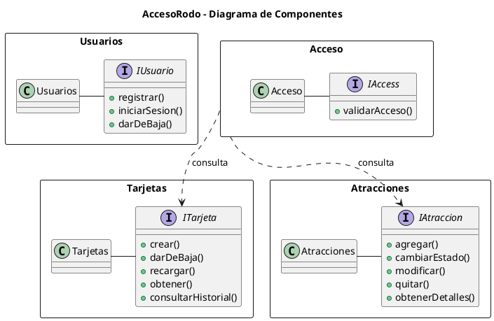

# TFU 3

## Objetivos
- Componentes e interfaces              X
- Escalabilidad horizontal o vertical   X
- Contenedores o máquinas virtuales     (Contenedores)
- ACID o BASE                           (Acid)
- Servicios sin estado                  ()

## Borrador

### Componentes

En caso de elegir una particion por dominio, los componentes podrian ser.

Estos dominios se identificaron mediante la agrupacion de responsabilidades diferentes de AccesoRodo 

1. **Tarjetas**:
    ¿Existe? ¿Está activa? ¿Tiene saldo?
2. **Usuarios**:
    ¿Quién es? ¿Está autenticado?
3. **Atracciones**:
    ¿Está activa? ¿Cuál es su capacidad? ¿Cuántas personas hay?
4. **Acceso**:
    ¿Puede esta tarjeta entrar a esta atracción en este momento?

> [!NOTE]
> Acceso solo se encarga de la validacion para acceder a un juego. Consulta Tarjetas y Atracciones para ver si es posible conceder el acceso.

#### Posibles operaciones

TARJETAS
├── Crear tarjeta                 POST
├── Dar de baja tarjeta           DELETE
├── Recargar tarjeta              PATCH
├── Ver tarjeta                   GET
└── Consultar historial           GET

USUARIOS
├── Registrar usuario             POST
├── Iniciar sesión                POST
└── Dar de baja usuario           DELETE

ATRACCIONES
├── Agregar atracción             POST
├── Cambiar estado                PATCH
├── Modificar atracción           PATCH
├── Quitar atracción              DELETE
└── Ver detalles de atracción     GET

ACCESO
└── Validar acceso a atracción    POST

### UML

### ACID o BASE
Debido a que aplicamos reintentos veo necesario utilizar ACID por que me parece adecuado al tener metodos como recargar, o al usar la tarjeta. No queremos que se cobre, o recargue más de una vez y esto se puede arreglar con la atomicidad de ACID.

Hay que ver como aplicarlo en el codigo

